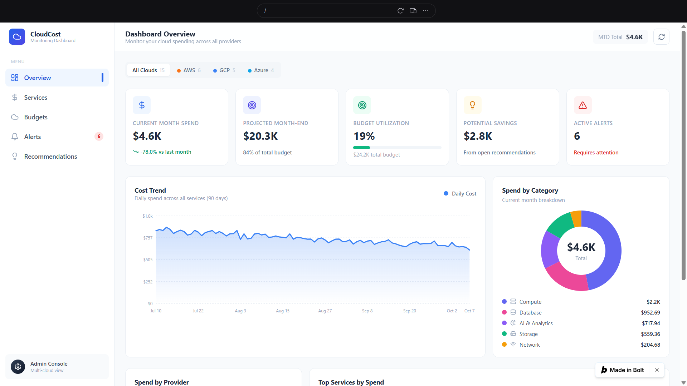
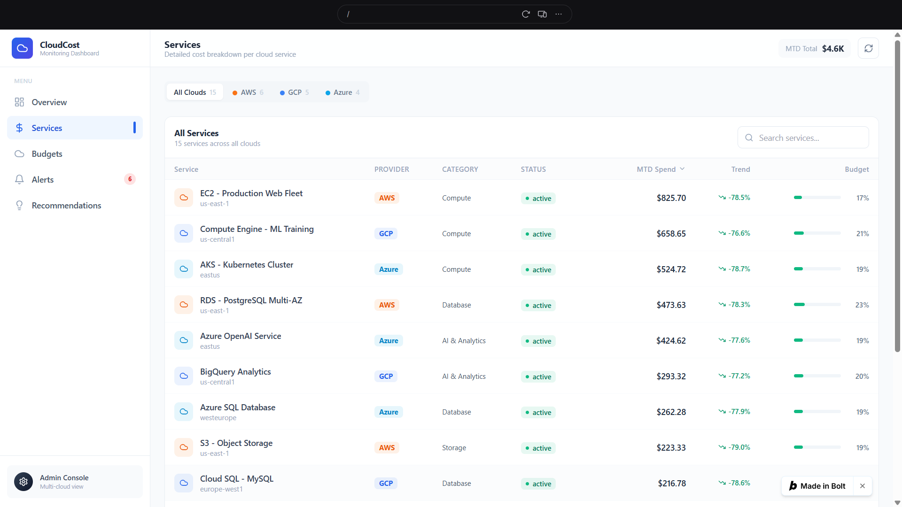
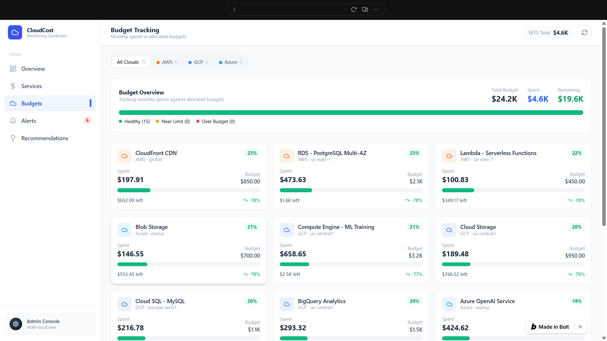
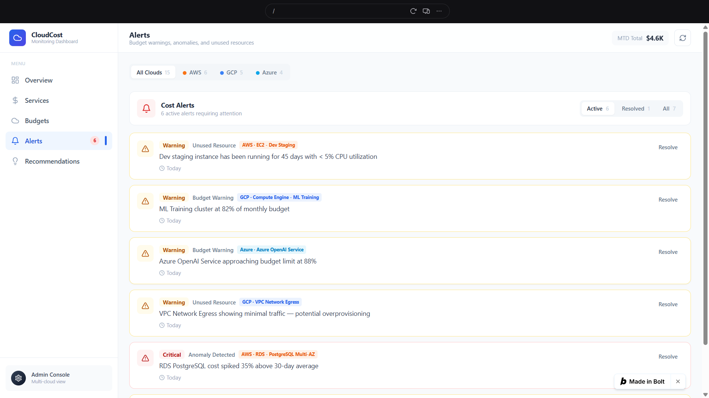
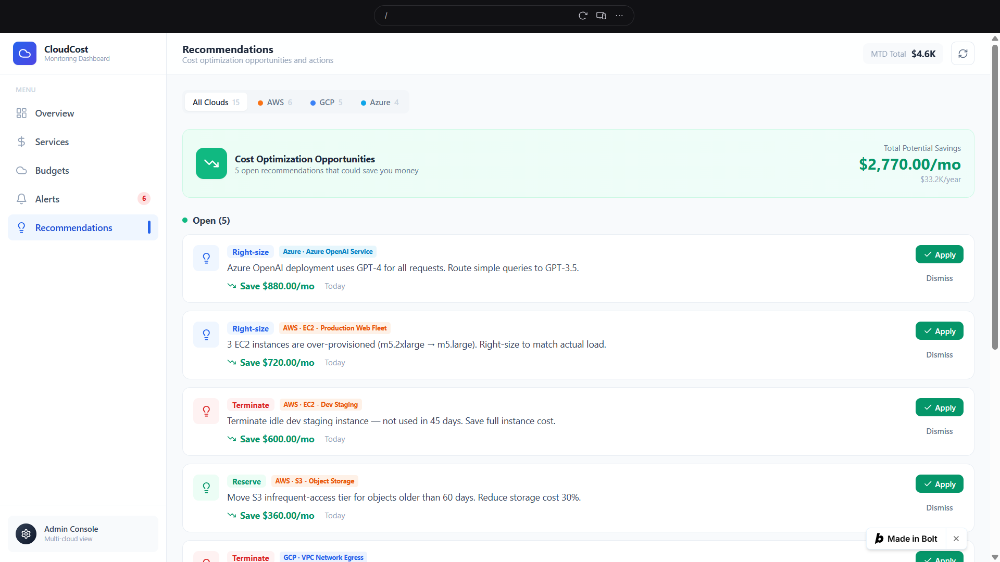

# ☁️ Cloud Cost Monitoring Dashboard

A responsive multi-cloud cost monitoring dashboard designed to help users analyze cloud spending, track budgets, monitor services, identify alerts, and discover potential cost-saving opportunities across AWS, Google Cloud, and Microsoft Azure.

## 🚀 Live Demo

👉 [View Live Demo](https://cloud-cost-monitorin-bll3.bolt.host)

## 🚀 Features

- 📊 Cloud spending overview dashboard
- ☁️ AWS, Google Cloud, and Azure cost monitoring
- 💰 Monthly spending and budget tracking
- 📈 Interactive cost trend charts
- 🔔 Cloud cost alerts
- 💡 Cost optimization recommendations
- 🖥️ Service-wise cost analysis
- 🔎 Cloud provider filtering
- 📱 Responsive dashboard interface

## 🛠️ Technologies Used

- React
- TypeScript
- Vite
- Tailwind CSS
- Supabase
- JavaScript/TypeScript
- Git & GitHub

## 📸 Screenshots

### Dashboard Overview



### Services Monitoring



### Budget Tracking



### Cost Alerts



### Cost Optimization Recommendations



## 🎯 Project Objective

The objective of this project is to provide a centralized dashboard for monitoring and analyzing cloud expenditure across multiple cloud providers.

The dashboard helps users understand their cloud spending, track budgets, monitor individual services, identify cost alerts, and discover potential optimization opportunities.

## 📊 Dashboard Modules

### 1. Overview

Provides a summary of:

- Current month spending
- Projected month-end cost
- Budget utilization
- Potential savings
- Active alerts
- Cloud spending trends

### 2. Services

Displays service-level spending information across AWS, Google Cloud, and Azure.

### 3. Budget Tracking

Allows users to monitor:

- Total budget
- Amount spent
- Remaining budget
- Budget utilization
- Individual service budgets

### 4. Alerts

Displays budget warnings, unused resources, anomalies, and other cloud cost alerts.

### 5. Recommendations

Provides cost optimization suggestions with estimated monthly savings.

Examples include:

- Right-sizing compute resources
- Removing idle resources
- Optimizing storage
- Reducing unnecessary network costs

## 🏗️ Architecture

```text
User
  ↓
React Web Application
  ↓
Dashboard Components
  ↓
Supabase Database
  ↓
Cloud Cost Data
  ↓
Analytics & Recommendations
  ↓
User Dashboard
